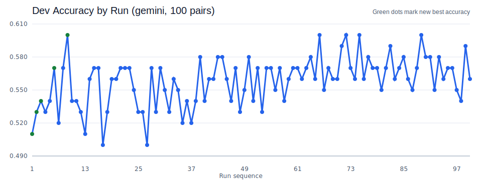
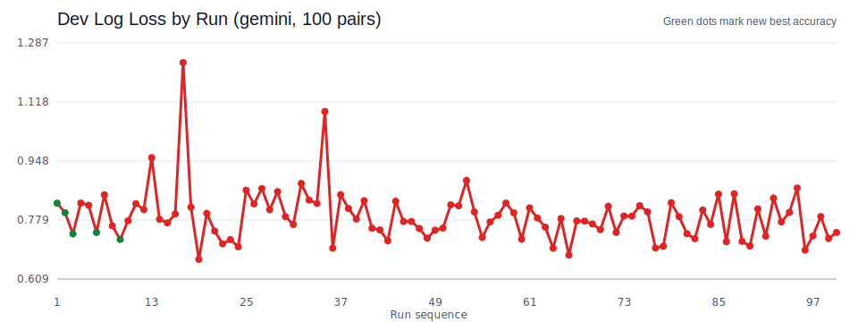

# Upworthy AutoSearch

Minimal agentic optimization for headline CTR prediction on the [Upworthy Research Archive](https://osf.io/jd64p/).

Inspired by [karpathy/autoresearch](https://github.com/karpathy/autoresearch): fixed evaluator, one editable strategy file, keep/revert loop.

## What It Does

- **V1**: Pairwise winner prediction — given two headlines for the same A/B test, predict which got higher CTR
- **Metric**: Accuracy on held-out test pairs (dev split during search, test split for final eval)
- **Loop**: Agent edits `strategy.md`, runs benchmark, keeps changes if dev accuracy improves, reverts if not

## Quick Start

```bash
# Install
pip install uv
uv sync

# Download data + build splits (~600MB download)
uv run python -m upworthy_autosearch.prepare_dataset

# Evaluate dev split (heuristic mode, no API key needed)
uv run python -m upworthy_autosearch.benchmark dev

# One search iteration
uv run python -m upworthy_autosearch.search

# One comparable Gemini run
set -a; source .env; set +a
EVAL_MAX_PAIRS=100 EVAL_WORKERS=3 uv run python -m upworthy_autosearch.search \
  --key-change "manual test" \
  --rationale "sanity check"

# Run tests
uv run pytest tests/
```

## Providers

Set `MODEL_PROVIDER` env var:

| Value | Requires |
|-------|----------|
| `heuristic` | Nothing (default) |
| `openai` | `OPENAI_API_KEY` |
| `gemini` | `GOOGLE_API_KEY` |
| `openai_compat` | `OPENAI_BASE_URL` |

## Files

| File | Editable by agent? |
|------|-------------------|
| `strategy.md` | YES |
| `prompt_templates/pairwise_judge.md` | YES |
| `src/upworthy_autosearch/benchmark.py` | NO |
| `src/upworthy_autosearch/prepare_dataset.py` | NO |
| `results/results.tsv` | Append only |

## Loop Mechanics

1. An outer coding agent or human edits `strategy.md` or the judge prompt
2. `search.py` evaluates the current working tree on the dev split
3. Results are appended to `results/results.tsv`
4. If new accuracy beats the best comparable historical run, the current edits are kept and committed
5. If not, `git checkout -- strategy.md prompt_templates/` reverts the editable search files

## Claude Code + Gemini Campaign

The main experiment in this repo is a clean Claude Code outer-loop run with Gemini as the pairwise evaluator.

- Outer agent: Claude Code
- Evaluator: `gemini-2.5-flash-lite`
- Comparable reporting cohort: `provider=gemini`, `n_pairs=100`
- Comparable dev runs in the merged history: `100`
- Total dev rows in the merged history: `103`
- Best dev accuracy: `0.6000`
- Best dev log loss overall in the reporting cohort: `0.6658`

What worked:

- Upworthy-specific framing was helpful. Prompt versions that explicitly grounded the model in Upworthy's audience and headline style consistently outperformed generic editor framing.
- Holistic psychological pull beat rigid signal scoring. The strongest prompt variants asked the model to judge whether a reader would feel compelled to click, rather than mechanically summing features.
- Reader-simulation variants were competitive. The best-ranked run used a "100 readers voting on each headline" framing, and several top runs used closely related audience-simulation prompts.

Artifacts:

- [Leaderboard](results/leaderboard.md)
- [Analysis summary](results/analysis_summary.md)
- [Extended analysis](results/extended_analysis.md)
- [Metrics CSV](results/metrics.csv)

Charts:




## Dataset

Upworthy Research Archive: ~32,000 A/B tests from 2012–2014. Each test has 2+ headline variants shown to different user segments. We use CTR (clicks/impressions) as ground truth.

Preprocessing: exclude broken rows (`problem==1`), exclude zero-impression rows, exclude ties (|CTR_a - CTR_b| < 0.001), split by test_id to avoid leakage.
