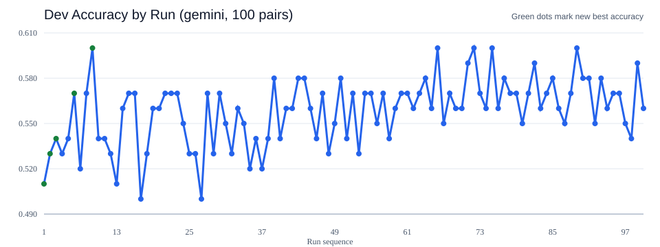
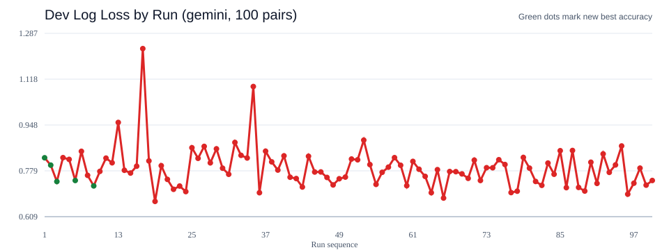

# Upworthy AutoSearch

LLM-driven headline CTR prediction on the [Upworthy Research Archive](https://osf.io/jd64p/). Agent iteratively edits a strategy file, runs benchmarks, and keeps/reverts changes based on dev accuracy — inspired by [karpathy/autoresearch](https://github.com/karpathy/autoresearch).

## Results

**Best dev accuracy:** 0.6000 &nbsp;·&nbsp; **Best dev log loss:** 0.6658  
100 gemini runs, 103 total dev runs, 5 improvements.

  
*Dev accuracy by run. Green dots mark new bests.*

  
*Dev log loss by run.*

[Leaderboard](results/leaderboard.md) · [Analysis summary](results/analysis_summary.md) · [Extended analysis](results/extended_analysis.md) · [Metrics CSV](results/metrics.csv)

## Quick Start

```bash
pip install uv && uv sync
uv run python -m upworthy_autosearch.prepare_dataset    # ~600MB download
uv run python -m upworthy_autosearch.benchmark dev      # heuristic eval
uv run python -m upworthy_autosearch.search              # one iteration
uv run pytest tests/
```

Set `MODEL_PROVIDER=gemini` (or `openai`/`heuristic`) and corresponding API key to run with an LLM evaluator.

## Loop

1. Edit `strategy.md` (or `prompt_templates/pairwise_judge.md`)
2. `search.py` evaluates on the dev split
3. If accuracy beats the best comparable run → keep & commit; else `git checkout` reverts editable files

## Files

| Editable by agent | Immutable |
|---|---|
| `strategy.md`, `prompt_templates/` | `src/`, `tests/` |

## Dataset

~32,000 A/B tests (2012–2014), each with 2+ headline variants shown to different user segments. Ground truth is CTR (clicks/impressions). We exclude broken rows, zero-impression rows, ties, and split by test_id to avoid leakage.
